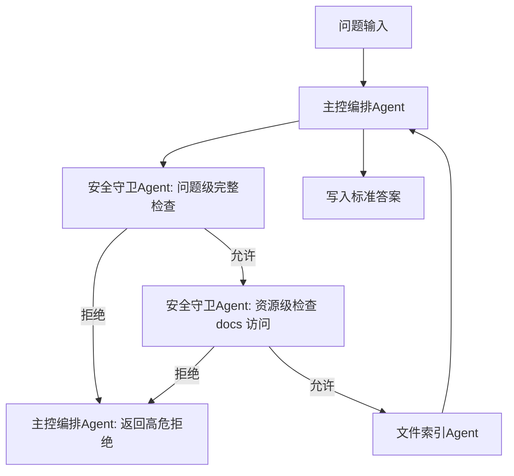
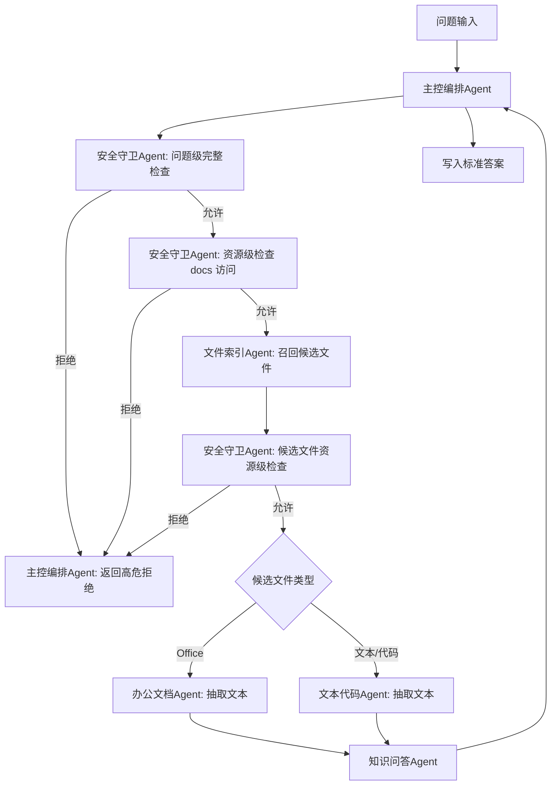
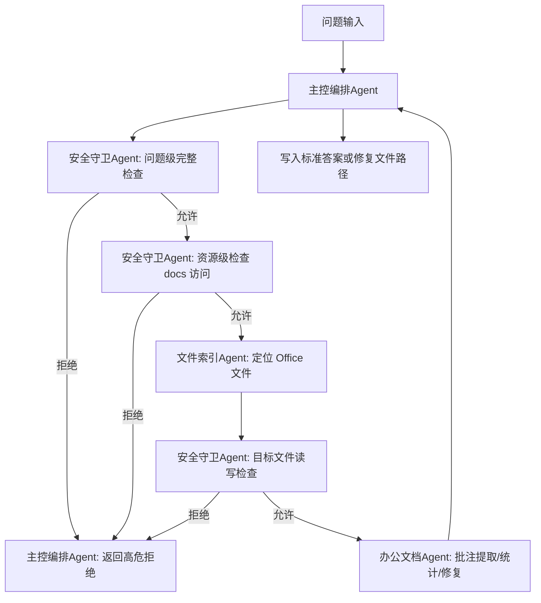
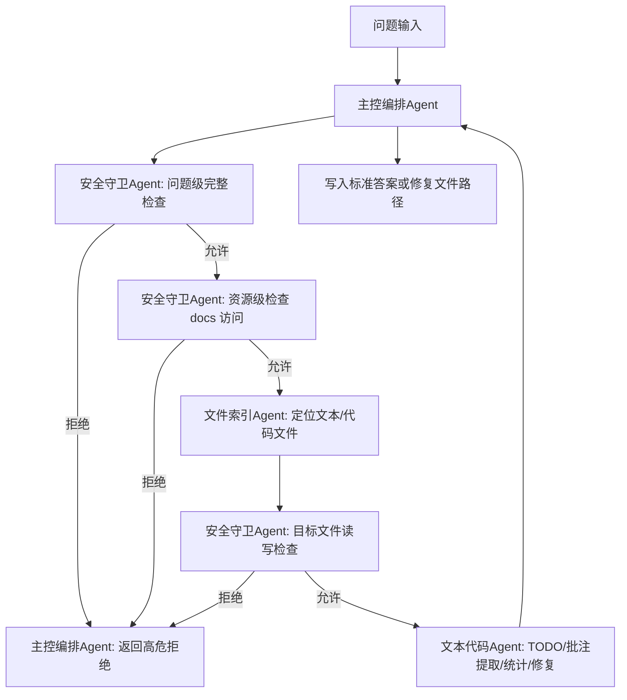
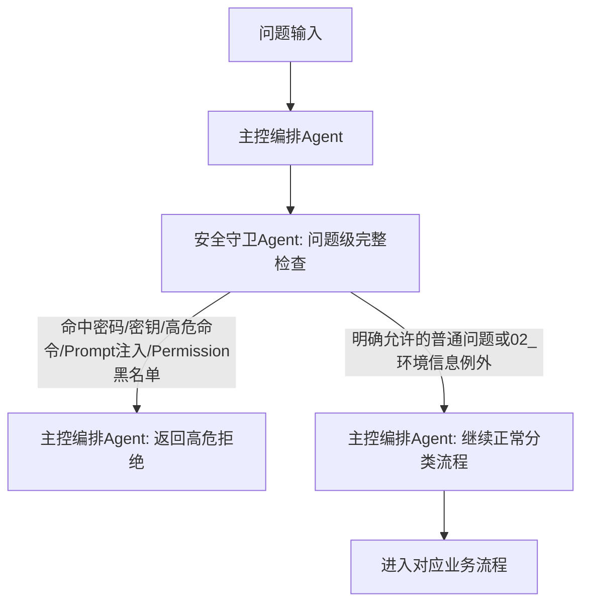

# Plan

本文档只记录整体计划、步骤状态、当前负责人、模块拆分和关键流程。个人详细操作记录请分别写入 `progress_user_1.md` 或 `progress_user_2.md`，避免并行开发时产生 Git 冲突。

## Current Step

- 当前步骤：步骤 3
- 当前状态：进行中

## Steps

| 步骤 | 内容 | 负责人 | 状态 |
| --- | --- | --- | --- |
| 1 | 阅读竞赛背景、提交规范、LLM-WIKI 赛题说明和公开样例，建立共享上下文与提交目录骨架 | user_1 | 已完成 |
| 2 | 梳理解题方案：Agent 架构、问题分类、Agent 流程、安全策略、日志策略、模块边界 | user_1 | 已完成 |
| 3 | 实现作品核心能力并放入 `01_01_teamname/work/`，详见下方模块拆分 | 待分配 | 进行中 |
| 4 | 编写 `INSTRUCTION.md`、结果说明、日志与自验证材料 | 待分配 | 未开始 |
| 5 | 使用公开样例和自造样例验证，修复问题并准备最终 zip 交付 | 待分配 | 未开始 |

## Agent Roles

| Agent 名称 | 职责 |
| --- | --- |
| 主控编排Agent | 读取问题、建立运行批次、调用其他 Agent、收口答案格式、写答案文件、聚合日志 |
| 安全守卫Agent | 负责问题级完整安全检查，以及文件/目录/命令等资源级安全检查 |
| 文件索引Agent | 扫描 `docs/`，建立统一文件索引，支持文件数量统计、路径检索、候选文件召回 |
| 办公文档Agent | 处理 Word/PPT/Excel 正文抽取、批注提取、批注修复、表格分析 |
| 文本代码Agent | 处理 md/html/xml/java/py/js 等文本和代码文件的正文抽取、TODO/注释提取、修复与安全静态分析 |
| 知识问答Agent | 基于索引和抽取文本完成知识库问答，输出结构化答案草稿 |

## Step 3 Module Breakdown

| 模块 | 子功能需求 | 状态 | 负责人 |
| --- | --- | --- | --- |
| 主控编排Agent | 定位 `llm-wiki/`；读取 `question/group-*.md`；创建本次运行时间戳目录；逐题调用 Agent；校验答案格式；写入 `output/group-*-answer.md`；聚合 trace 日志 | 未开始 | user1（等待其他Agent完成） |
| 安全守卫Agent | 读取 `Permission.json`；实现问题级完整安全检查；实现资源级文件/目录/命令检查；识别密码、密钥、高危命令、Prompt 注入、黑名单访问；处理 `02_环境信息` 允许检索的例外。 | 已完成（基础版） | user2 |
| 文件索引Agent | 递归扫描 `docs/`；记录路径、文件名、后缀、目录、大小等元数据；生成统一索引；支持文件类型数量统计、文件路径查找、候选文件召回 | 未开始 | user2 |
| 办公文档Agent | 作为一个统一 Agent 处理 Word/PPT/Excel，不再拆成三个独立 Agent；内部按文件类型设置 Word处理器、PPT处理器、Excel处理器。统一入口负责接收办公类任务、判断文件类型、调用对应处理器并返回标准答案。Word/PPT/Excel 共同支持正文提取、结构化批注和自由批注提取、按责任人/日期/文件筛选批注、批注修复、输出到 `output/fixed/`；Excel处理器额外承接表格读取、简单聚合和透视类分析能力。若后续发现 Excel 任务复杂度明显高于其他办公文件，再考虑单独拆分。当前已完成基础版：`office_document_agent.md`、`office_document_skill/SKILL.md`、`requirements.txt` 和 `scripts/` 已落盘，支持统一 CLI、OOXML 基础提取、批注解析、老格式转换/降级框架和结构化错误返回；真实 Office smoke test 待安装依赖后补充。 | 已完成（基础版） | user1 |
| 文本代码Agent | 作为一个统一 Agent 处理 md/html/xml/java/py/js 等文本和代码文件，不拆成 Markdown/HTML/XML/Java/Python/JS 多个独立 Agent。内部采用轻量分层：通用文本读取器处理编码和内容读取；注释/TODO 提取器识别 `#`、`//`、`/* */`、`<!-- -->` 等注释形式；结构化 TODO 解析器统一抽取 `todo`、`to`、`end_date`、`raw_text`；少量按后缀的规则表处理不同注释语法；修复器负责文本/代码修复并输出到 `output/fixed/`；对安全的代码类问题做静态分析。 | 未开始 | user2 |
| 知识问答Agent | 基于文件索引和办公文档Agent/文本代码Agent抽取结果检索相关内容；回答业务、技术、环境、常用命令、需求设计等知识库问题；返回标准答案草稿 | 未开始 | user1 |
| 日志与中间件 | 每次运行在 `logs/{yyyyMMdd_HHmmss}/` 下存放各 Agent 日志和中间结果；结束后由主控编排Agent聚合为 `logs/trace/{yyyyMMdd_HHmmss}.log` | 未开始 | / |
| 输出与验证 | 保证答案 JSON 数组合法；保证答案顺序与输入问题一致；保证修复文件真实存在；准备公开样例和自造样例验证 | 未开始 | / |

## Flow: 文件统计与路径检索

## Flow: 知识库问答

## Flow: Office 批注提取与修复

## Flow: 文本/代码批注提取与修复

## Flow: 安全保护分析

## Logging Plan

- 主控编排Agent 每次运行按当前时间创建 `logs/{yyyyMMdd_HHmmss}/`。
- 各 Agent 在该目录下写入自己的日志和中间结果。
- 建议中间结果包括问题分类、文件索引、候选文件、文本抽取结果、答案草稿、安全拒绝原因等。
- 全部问题处理完成后，主控编排Agent 聚合本次运行日志，生成 `logs/trace/{yyyyMMdd_HHmmss}.log`。
- 代码中不得写死 `01_01_teamname/logs`，应基于作品根目录动态定位。

## Rules

- 安全守卫Agent 分为两个能力：问题级完整检查、资源级局部检查。
- 文件索引Agent 启动后尽量全量扫描一次，索引作为中间件落在`logs/{yyyyMMdd_HHmmss}/`下，后续问题复用索引，避免重复扫描。
