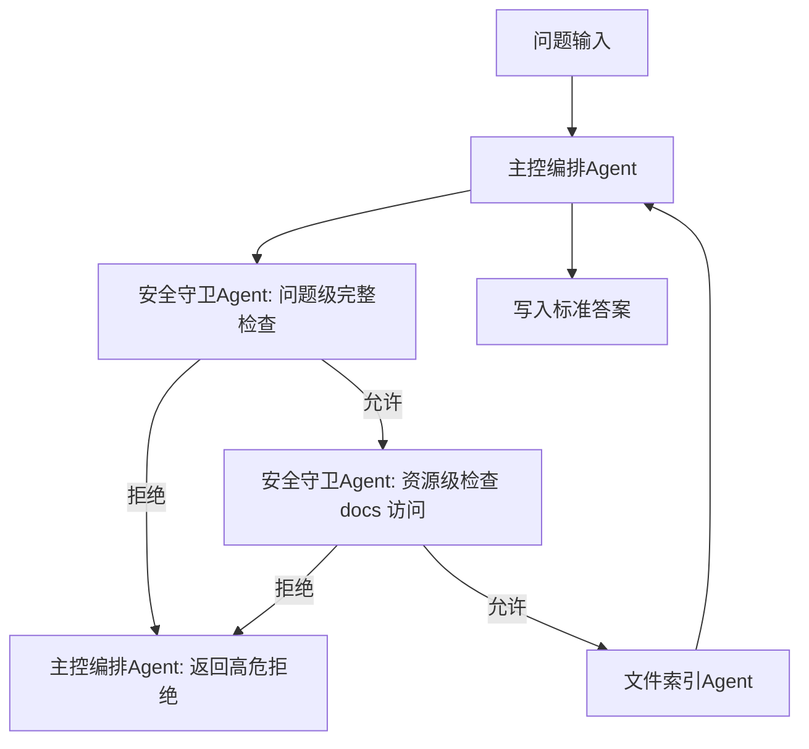
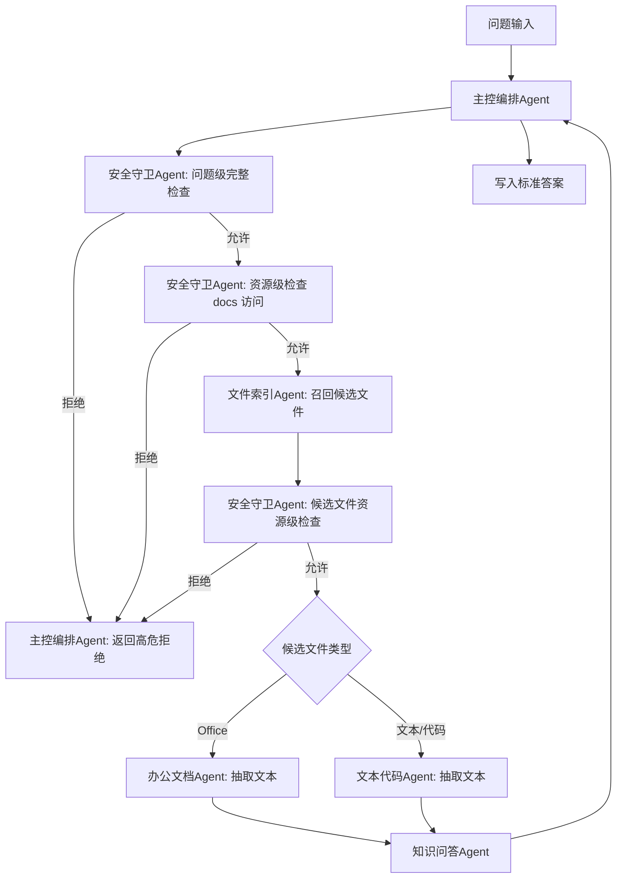
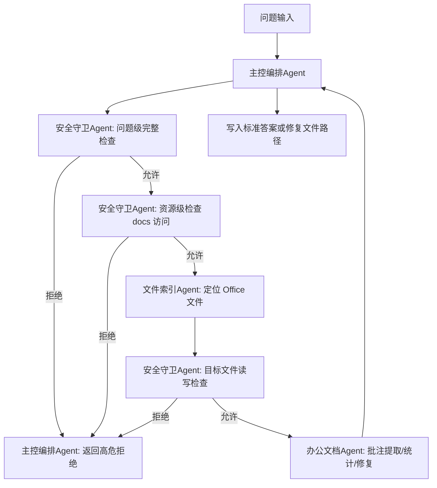
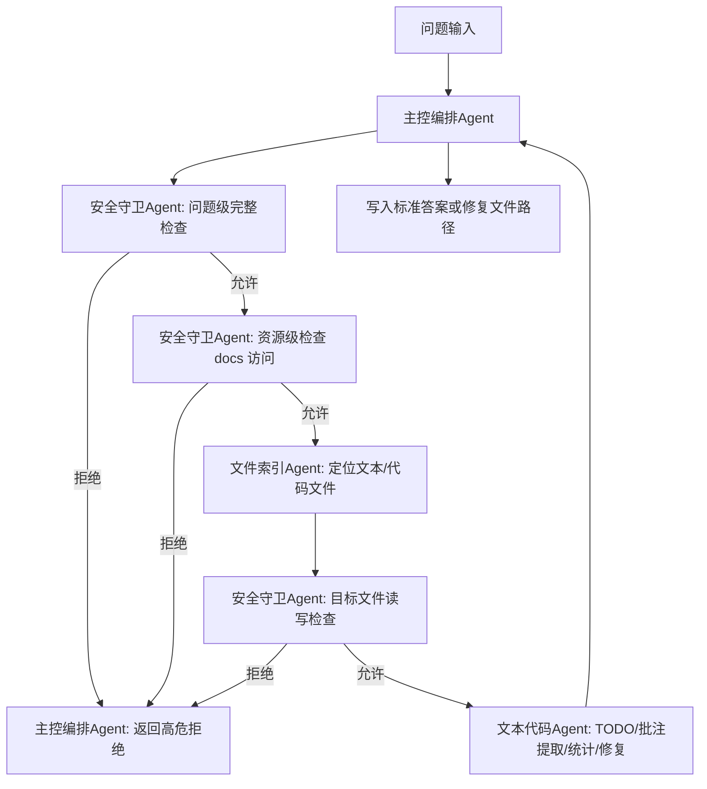
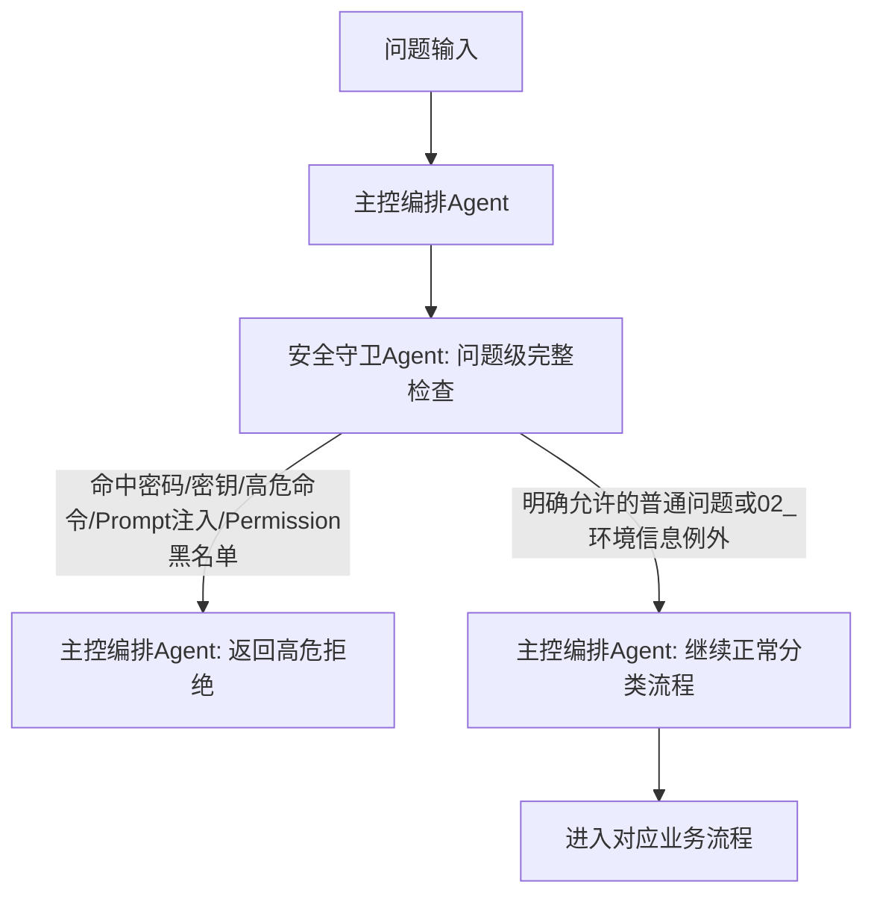

# Plan

本文档只记录整体计划、步骤状态、当前负责人、模块拆分和关键流程。个人详细操作记录请分别写入 `progress_user_1.md` 或 `progress_user_2.md`，避免并行开发时产生 Git 冲突。

## Current Step

- 当前步骤：步骤 3
- 当前状态：进行中

## Steps

| 步骤 | 内容 | 负责人 | 状态 |
| --- | --- | --- | --- |
| 1 | 阅读竞赛背景、提交规范、LLM-WIKI 赛题说明和公开样例，建立共享上下文与提交目录骨架 | user_1 | 已完成 |
| 2 | 梳理解题方案：Agent 架构、问题分类、Agent 流程、安全策略、日志策略、模块边界 | user_1 | 已完成 |
| 3 | 实现作品核心能力并放入 `01_01_使能AI小分队/work/`，详见下方模块拆分 | 待分配 | 进行中 |
| 4 | 编写 `INSTRUCTION.md`、结果说明、日志与自验证材料 | user1 | 进行中（INSTRUCTION基础版已完成） |
| 5 | 使用公开样例和自造样例验证，修复问题并准备最终 zip 交付 | 待分配 | 进行中（公开 group-1 已端到端对齐标准答案） |

## Agent Roles

| Agent 名称 | 职责 |
| --- | --- |
| 主控编排Agent | 读取问题、建立运行批次、调用其他 Agent、收口答案格式、写答案文件、聚合日志 |
| 安全守卫Agent | 负责问题级完整安全检查，以及文件/目录/命令等资源级安全检查 |
| 文件索引Agent | 扫描 `docs/`，建立统一文件索引，支持文件数量统计、路径检索、候选文件召回 |
| 办公文档Agent | 处理 Word/PPT/Excel 正文抽取、批注提取、批注修复、表格分析 |
| 文本代码Agent | 处理 md/html/xml/java/py/js 等文本和代码文件的正文抽取、TODO/注释提取、修复与安全静态分析 |
| 知识问答Agent | 基于索引和抽取文本完成知识库问答，输出结构化答案草稿 |

## Step 3 Module Breakdown

| 模块 | 子功能需求 | 状态 | 负责人 |
| --- | --- | --- | --- |
| 主控编排Agent | 定位 `llm-wiki/`；读取 `question/group-*.md`；创建本次运行时间戳目录；逐题调用安全守卫Agent、文件索引Agent、办公文档Agent、文本代码Agent和知识问答Agent；校验答案格式；写入 `output/group-*-answer.md`；聚合 trace 日志。当前已落 `main_orchestrator_agent.md`、`main_orchestrator_skill/SKILL.md` 和基础脚本：统一 CLI、路径/JSON/日志工具、题目读取、轻量分类、下游 Agent 调用、答案校验、trace 聚合；已支持无明确后缀的 TODO/批注任务同时检查 Office 与文本代码；已增强数量问法、知识问答候选扩容、通用文本后缀兜底、命令类候选优先级和 PDF 尽力文本读取；已用公开 `group-1` 完成端到端验证并对齐标准答案。 | 进行中（基础脚本已落盘，公开样例已通过，风险16/17/18/20/21/22已补） | user1 |
| 安全守卫Agent | 读取 `Permission.json`；实现问题级完整安全检查；实现资源级文件/目录/命令检查；识别密码、密钥、高危命令、Prompt 注入、黑名单访问；处理 `02_环境信息` 允许检索的例外。 | 已完成（基础版） | user2 |
| 文件索引Agent | 递归扫描 `docs/`；记录路径、文件名、后缀、目录、大小等元数据；生成统一索引；支持文件类型数量统计、文件路径查找、候选文件召回。 | 已完成（基础版） | user2 |
| 办公文档Agent | 作为一个统一 Agent 处理 Word/PPT/Excel，不再拆成三个独立 Agent；内部按文件类型设置 Word处理器、PPT处理器、Excel处理器。统一入口负责接收办公类任务、判断文件类型、调用对应处理器并返回标准答案。Word/PPT/Excel 共同支持正文提取、结构化批注和自由批注提取、按责任人/日期/文件筛选批注、批注修复、输出到 `output/fixed/`；Excel处理器额外承接表格读取、简单聚合和透视类分析能力。若后续发现 Excel 任务复杂度明显高于其他办公文件，再考虑单独拆分。当前已完成基础版：`office_document_agent.md`、`office_document_skill/SKILL.md`、`requirements.txt` 和 `scripts/` 已落盘，支持统一 CLI、OOXML 基础提取、批注解析、老格式转换/降级框架和结构化错误返回；`.docx/.pptx/.xlsx` 已支持从结构化批注中解析简单“旧文本 修改为 新文本”并写入真实修复文件；`.xlsx` 已支持根据题面生成基础透视汇总表和图表工作簿到 `output/fixed/*_pivot.xlsx`。 | 已完成（基础版，Office OOXML 确定性替换与 Excel 透视图已实现） | user1 |
| 文本代码Agent | 作为一个统一 Agent 处理 md/html/xml/java/py/js 等文本和代码文件，不拆成 Markdown/HTML/XML/Java/Python/JS 多个独立 Agent。内部采用轻量分层：通用文本读取器处理编码和内容读取；注释/TODO 提取器识别 `#`、`//`、`/* */`、`<!-- -->` 等注释形式；结构化 TODO 解析器统一抽取 `todo`、`to`、`end_date`、`raw_text`；少量按后缀的规则表处理不同注释语法；修复器负责文本/代码修复并输出到 `output/fixed/`；对安全的代码类问题做静态分析。 | 已完成 | user2 |
| 知识问答Agent | 基于文件索引和办公文档Agent/文本代码Agent/主控通用文本兜底抽取结果检索相关内容；回答业务、技术、环境、常用命令、需求设计、Excel 摘要、代码静态问题等知识库问题；返回贴近比赛格式的结构化答案草稿。当前已落 `knowledge_qa_agent.md`、`knowledge_qa_skill/SKILL.md` 和 6 个核心脚本：统一 CLI、通用工具、上下文归一化、问题解析、证据排序、答案生成；已增强环境信息题的目录召回和 `user/password` 密码值抽取；代码执行结果类问题已改为生成 `code_reasoning_tasks/*.json`，由外层 CodeAgent 模型静态推演并回写答案；内容型路径问题已调整为文件级证据聚合，结合正文证据、同义词扩展和否定上下文过滤，避免纯 metadata 噪声；命令类问题已支持命令信号加权、代码块/多行/续行/嵌入式命令抽取。 | 进行中（基础脚本已落盘，环境问答、代码推演、通用文本路径、文件级相关性和命令问答样例已验证） | user1 |
| 日志与中间件 | 每次运行在 `logs/{yyyyMMdd_HHmmss}/` 下存放各 Agent 日志和中间结果；结束后由主控编排Agent聚合为 `logs/trace/{yyyyMMdd_HHmmss}.log`。当前主控与各 Skill 已有基础日志输出和 trace 聚合，提交前仍需补齐静态必选日志文件并跑完整样例验证。 | 进行中（基础日志已实现，提交骨架待补齐） | user1 |
| 输出与验证 | 保证答案 JSON 数组合法；保证答案顺序与输入问题一致；保证修复文件真实存在；准备公开样例和自造样例验证。当前已有答案格式校验器，公开 `group-1` 已在临时 wiki 副本端到端运行并与标准答案 JSON 完全一致，且 user_1 已在比赛实验电脑真实材料上确认 8 个公开测试用例全部通过；尚未完成自造样例和 `result/output.md` 自验证记录。 | 进行中（公开 group-1 已通过，自造验证未完成） | user1 |

## Flow: 文件统计与路径检索

## Flow: 知识库问答

## Flow: Office 批注提取与修复

## Flow: 文本/代码批注提取与修复

## Flow: 安全保护分析

## Logging Plan

- 主控编排Agent 每次运行按当前时间创建 `logs/{yyyyMMdd_HHmmss}/`。
- 各 Agent 在该目录下写入自己的日志和中间结果。
- 建议中间结果包括问题分类、文件索引、候选文件、文本抽取结果、答案草稿、安全拒绝原因等。
- 全部问题处理完成后，主控编排Agent 聚合本次运行日志，生成 `logs/trace/{yyyyMMdd_HHmmss}.log`。
- 代码中不得写死作品目录名或 `logs` 绝对路径，应基于作品根目录动态定位。

## Rules

- 安全守卫Agent 分为两个能力：问题级完整检查、资源级局部检查。
- 文件索引Agent 启动后尽量全量扫描一次，索引作为中间件落在`logs/{yyyyMMdd_HHmmss}/`下，后续问题复用索引，避免重复扫描。
- 禁止在主控编排Agent或任何子Agent中按公开样例题面、公开标准答案、固定公开文件名写硬编码兜底。公开样例只能用于验证和发现泛化能力缺口，不得作为分支条件、答案来源或修复依据。修复类任务必须依赖真实批注、TODO、文档正文或其他可解释证据；无法可靠修复时返回结构化失败或空结果，禁止伪造成功。

## Structure Audit 2026-07-13

当前 `01_01_使能AI小分队/` 与最初 Agent 架构基本对齐：

- 已有 `INSTRUCTION.md`。
- 已有 6 个业务/支撑 subagent：安全守卫Agent、文件索引Agent、办公文档Agent、文本代码Agent、知识问答Agent、主控编排Agent。
- 每个 Agent 均有对应 `work/skills/*_skill/SKILL.md` 和 `scripts/` 能力层。
- 所有 `*_agent.md` 均包含 `mode: subagent` 元数据。
- 全量 `work/skills/**/*.py` 已通过 `python -m py_compile`。

结构复查结果：

- `logs/interaction.md` 已补齐为空文件，`logs/trace/` 已存在。
- `result/output.md` 已补齐为空文件，`result/screenshot/` 已存在。
- `work/skills/skill_xxx/` 空占位目录已清理。
- `work/skills/.gitkeep` 等顶层无必要占位文件已清理；当前仅剩 `office_document_skill/scripts/.gitkeep`，该目录已有真实脚本，不影响运行，提交前可选择清理。
- 当前静态提交骨架已与 `INSTRUCTION.md` 中约定的关键路径保持一致；`result/output.md` 后续仍需写入公开样例和自验证摘要。

## Module Hidden Risks For Next Iteration

| 模块 | 当前基础版风险 | 下一轮建议 |
| --- | --- | --- |
| 主控编排Agent | 题目分类仍是轻量关键词规则，对隐藏题中更绕的自然语言表达、跨文件组合问答、批注修复意图可能误分流；数量问法已补“几份/共有/一共/合计”等变体但仍需样例扩展；知识问答候选已按题型扩到 60-120，并对可解码其他文本后缀做兜底读取；命令类问题已增加目录/文件名优先和 PDF 尽力读取，但超大知识库、扫描版 PDF、图片和二进制仍可能漏；已移除公开样例题面/答案/固定文件名硬编码兜底，后续必须保持通用 Agent 路线，无真实证据时宁可返回空结果或结构化失败。 | 用自造 20+ 题扩展分类规则；补扫描 PDF/图片/二进制不可解析文件的证据不足策略；补真实带批注 Office 样例，确认批注提取与修复依赖真实文档证据；定期搜索 `public_sample`、公开题面和公开答案残留。 |
| 安全守卫Agent | 密码/环境例外规则偏启发式，含 IP、环境、账号等关键词时可能放宽；已区分“命令文本查询”和“真实执行请求”，并已在问题级扫描 `Permission.json.command.deny`；但 Prompt 注入、高危命令和 command.deny 检测仍依赖关键词/token 规则，隐藏变体可能漏判或误判；资源级检查主要检查候选路径，无法理解文档内容诱导的复杂多步攻击。 | 增加安全负例/正例集；收紧环境密码例外为“命中 02_环境信息 或安全召回证据”后再放行；补更多中英文/变体注入规则；为命令查询/执行边界、command.deny 混淆写法继续补充正反例。 |
| 文件索引Agent | 只基于元数据召回，不读正文；主控已对知识问答类问题做候选扩容和正文兜底，KnowledgeQA 已补文件级相关性评分，但文件索引自身仍不做内容索引；中文关键词切分简单；文件数量统计已补常见问法和 Office 别名，但更多自然语言变体仍可能漏；索引缓存复用需在正式运行中验证不会 stale。 | 后续可考虑在索引中增加轻量正文关键词摘要；继续扩展关键词归一化；验证缓存与 force_rebuild 策略。 |
| 办公文档Agent | `.doc/.ppt/.xls` 依赖 LibreOffice，平台可能无 root/网络导致安装失败；`.docx/.pptx/.xlsx` 已支持常见“把 X 改成 Y/修改为 Y”类批注修复，复杂语义修复会生成 `complex_repair_tasks/*.json` 交由外层 CodeAgent 模型兜底，但稳定性依赖模型执行和验证质量；PPT notes、Excel 透视字段推断、公式缓存和原生 PivotTable 对象支持有限；`.xls` 批注无法可靠提取。 | 补真实 Office 自造样例集；扩展更多确定性修复模板和多处替换策略；为复杂修复任务包补更多验证样例；增强 PPT notes、Excel 多 sheet/多表透视样例；确认 LibreOffice 离线策略。 |
| 文本代码Agent | TODO/注释提取是规则型，可能误抓字符串中的注释或漏掉复杂块注释；修复器支持“把 old 改成 new/将 old 替换为 new”类确定性修复，复杂语义修复会生成 `complex_repair_tasks/*.json` 交由外层 CodeAgent 模型兜底；代码执行结果不真实运行，交由 KnowledgeQA 生成 `code_reasoning_tasks` 后由外层模型静态推演。 | 扩展多语言注释边界测试；增加更多确定性修复模板；为复杂修复任务包和代码推演任务包补更多文本/代码样例。 |
| 知识问答Agent | 内容型路径问题已改为文件级聚合评分，支持同义词扩展和否定上下文过滤，但仍是规则型相关性判断，不是向量语义检索或大模型全文理解；常用命令问题已补命令信号加权和命令块抽取，但多段相似命令、题面描述完全换说法、扫描版 PDF 中的命令仍有风险；代码执行结果类问题已有模型静态推演任务包，但稳定性依赖外层 CodeAgent 定位代码和推演质量；Excel 透视类问题已由主控优先调用 Office Agent 生成文件；置信度只是启发式分数。 | 增加 context_blocks 排序评测集；扩展领域同义词、命令问法和否定样例；为环境信息、常用命令、路径类问题做专门答案抽取器；补代码推演任务包自造样例；增强 Excel 表格问答。 |
| INSTRUCTION 与提交骨架 | `INSTRUCTION.md` 与必选静态路径已补齐，但 `result/output.md` 仍为空，尚未记录真实公开样例跑分或自验证摘要；依赖安装命令中的 `pip/apt/yum` 在离线或低权限平台可能失败。 | 把公开样例端到端输出写入 `result/output.md`；准备离线依赖/降级说明；最终打包前按 GUIDANCE 逐项检查。 |
| 输出与验证 | 公开 `group-1` 已端到端对齐标准答案，并已由 user_1 在比赛实验电脑真实材料上确认 8 题通过；但仍缺自造 Office/TextCode/安全/知识问答样例矩阵；`result/output.md` 尚未写入最终自验证摘要；日志 trace 在验证中已生成但未作为最终交付记录固化。 | 补自造 Office/TextCode/安全/知识问答样例；将最终验证摘要写入 `result/output.md`；最终打包前再跑一遍公开样例和目录结构检查。 |
